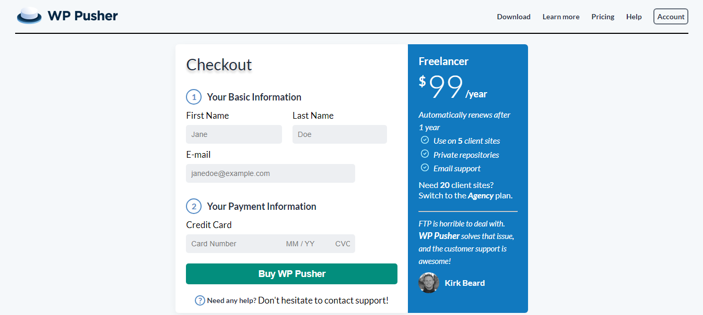

# WP PUSHER

## Overview

This project is a single page webpage developed as part of an assignment for AltSchool Africa. The goal is to create a simple and visually appealing webpage that showcases basic web development skills.

## Features

- **Single Page Design:** The webpage is designed as a single, cohesive unit to provide a seamless user experience.
- **Responsive:** The webpage is designed to be responsive, ensuring a consistent experience across different devices and screen sizes.

## Technologies Used

- HTML5
- CSS3

## How to Use

1. Clone the repository:

   ```bash
   `git clone https://github.com/XAI-1/Altschool-assignment-WP-PUSHER-`
   ```

2. Open `index.html` in your preferred web browser.

## Preview



## Credits

- [Ikhajiagbe Nehemaiah Oseremen](https://github.com/XAI-1)
- [AltSchool Africa](https://altschoolafrica.com/)
